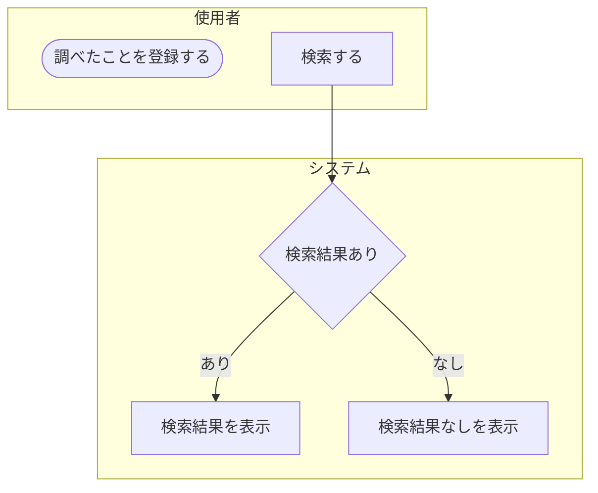
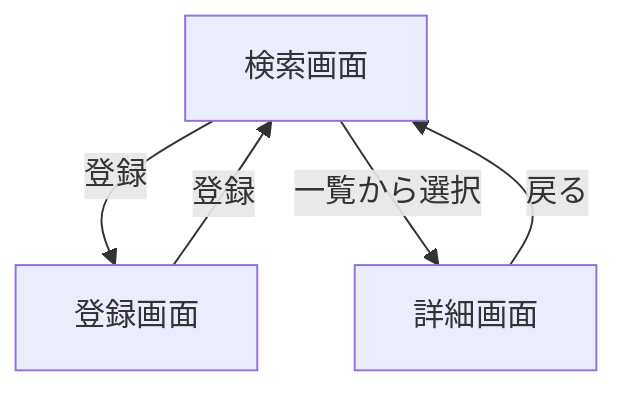

# 設計

## 1.業務フロー

```mermaid
flowchart TD
   subgraph 使用者
      A(["調べたことを登録する"])
      B["検索する"]
   end

   subgraph システム
      C{"検索結果あり"}
      D["検索結果を表示"]
      E["検索結果なしを表示"]
   end

   B --> C
   C --> |あり| D
   C --> |なし| E

```

## 2.画面遷移図

```mermaid
flowchart TD
   検索画面 -- 登録 --> 登録画面 
   登録画面 -- 登録 --> 検索画面
   検索画面 -- 一覧から選択 --> 詳細画面
   詳細画面 -- 戻る --> 検索画面 
```

## 3.ワイヤーフレーム

## 4.テーブル定義書
